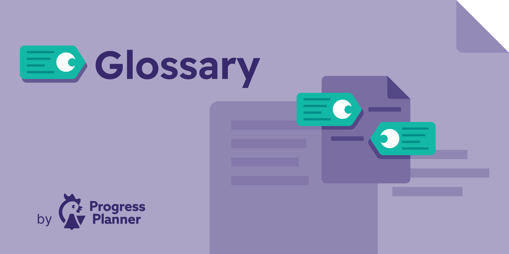

# Inline Glossary by Progress Planner

[](https://playground.wordpress.net/?blueprint-url=https%3A%2F%2Fprogressplanner.com%2Fresearch%2Fblueprint-glossary.php)



Glossary is a WordPress glossary plugin that helps you explain important terms directly inside your content. It automatically links glossary terms on first mention, opens accessible click-to-open definitions, and lets you publish a browsable glossary page with structured data.

## Why use Glossary?

- Turn key terms into helpful definitions without cluttering your content
- Create a central glossary page with alphabetical navigation
- Improve accessibility with keyboard-friendly, semantic markup
- Add `DefinedTerm` and `DefinedTermSet` schema for glossary content
- Stay lightweight: no builder, no external dependency, no complex setup

## Features

- **Automatic term linking** for the first mention of each glossary entry in your content
- **Click-triggered popovers** for short definitions and a clear path to read more
- **Dedicated glossary entries** with short description, long description, synonyms, and matching controls
- **Glossary List block** to publish a full glossary page in the block editor
- **Semantic, accessible output** using `<dfn>`, `<aside>`, keyboard support, and screen-reader friendly interactions
- **Schema.org support** for `DefinedTerm` and `DefinedTermSet`, with Yoast SEO integration when available
- **Synonyms, case-sensitive matching, and auto-link exclusions** for better editorial control
- **CSS custom properties** for easy styling without rebuilding assets

## Screenshots

1. Glossary entry editor with fields for the term, short definition, long description, and synonyms.
2. Glossary List block placeholder in the editor before publishing your WordPress glossary page.
3. Click-triggered glossary definition popover shown inline inside post content.
4. Front-end glossary page with alphabetical navigation, synonyms, and full term descriptions.
5. Glossary settings for selecting the glossary page and controlling where term linking runs.

## Requirements

- WordPress 6.0 or higher
- PHP 7.4 or higher
- Modern browsers for the best popover experience
  - Chrome / Edge 114+
  - Safari 17+
  - Firefox support is currently limited because Popover API and CSS Anchor Positioning support is still evolving

## Installation

### Install from WordPress admin

1. In your WordPress dashboard, go to **Plugins → Add New**.
2. Search for **Glossary**.
3. Click **Install Now** and then **Activate**.

### Install manually

1. Download this repository or the plugin ZIP.
2. Upload it to `/wp-content/plugins/`.
3. Activate **Glossary** in **Plugins**.

## Quick start

1. Go to **Glossary → Add new entry**.
2. Add a term title, short description, optional long description, and any synonyms.
3. Publish the entry.
4. Create a page for your glossary.
5. Add the **Glossary List** block to that page.
6. Go to **Glossary → Settings** and select your glossary page.

Once configured, Glossary automatically links the first matching mention of each term in supported content and opens a popover with the short definition.

## How it works

### Glossary entries

Each glossary entry supports:

- **Short description** for inline popovers
- **Long description** for the full glossary page
- **Synonyms** for alternate matches
- **Case-sensitive matching** when exact casing matters
- **Disable auto-linking** when you want an entry listed but not linked in content

### Glossary page

The Glossary List block displays:

- Optional heading
- Alphabetical navigation
- Grouped entries by letter
- Synonyms where available
- Long descriptions with fallback behavior when needed

### Structured data

Glossary outputs structured data for glossary content:

- With **Yoast SEO**, glossary entities are added to Yoast's JSON-LD graph
- Without Yoast SEO, the plugin outputs equivalent Microdata markup in the front end

## Accessibility

Glossary is built around click interactions instead of hover-only behavior and includes:

- Semantic HTML elements
- Keyboard navigation
- Visible focus states
- Screen-reader friendly labels and relationships
- Accessible popover behavior that avoids overlapping definitions

## Customization

The plugin uses CSS custom properties for easy theme-level styling.

```css
:root {
  --glossary-underline-color: rgba(0, 0, 0, 0.4);
  --glossary-underline-hover-color: rgba(0, 0, 0, 0.7);
  --glossary-focus-color: #005a87;
  --glossary-bg-color: #fff;
  --glossary-border-color: #ddd;
  --glossary-text-color: #333;
  --glossary-heading-color: #000;
  --glossary-link-color: #0073aa;
  --glossary-accent-color: #0073aa;
  --glossary-nav-bg: #fff;
  --glossary-letter-bg: #f5f5f5;
  --glossary-letter-color: #333;
  --glossary-letter-hover-bg: #0073aa;
  --glossary-letter-hover-color: #fff;
  --glossary-entry-bg: #f9f9f9;
  --glossary-meta-color: #666;
}
```

You can also control where auto-linking runs with filters such as:

```php
add_filter( 'inline_glossary_disabled_post_types', function( $post_types ) {
	return array( 'product', 'custom_post_type' );
} );
```

## Development

No build step is required.

```bash
composer install
composer run check-cs
composer run lint
composer run phpstan
```

## License

GPL v3 or later
